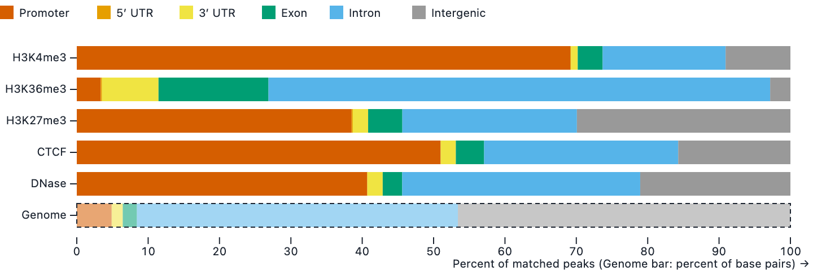

# peakwhere

**Where do your peaks land?** Drop in a gene annotation and your ChIP-seq, CUT&RUN or
ATAC-seq peaks, and see how they split across promoters, UTRs, exons, introns and
intergenic space, one bar per file. It runs in your browser. Nothing is uploaded.

### → [Open peakwhere](https://seandavi.github.io/peakwhere/)



*The built-in example: five ENCODE thymus experiments on mouse chr19. Click **Try the
example** to reproduce it.*

## Why

It's the first question anyone asks of a new peak set, and the answer usually needs R,
ChIPseeker, and a matching TxDb package. peakwhere needs a browser and two files.

- **Private by construction.** Files are read in the tab. No server, no account, no
  analytics, no fonts or scripts from anywhere else. Check the network panel.
- **Fast.** All of GENCODE mouse plus five ENCODE peak files: **2.9 s** in Chrome, with
  the page responsive throughout. Changing a setting re-draws in under half a second,
  without re-reading the annotation.
- **Right.** On the full reference data every category of every file matches an
  independent `bedtools` pipeline to two decimal places. So does a CSV that writes
  chromosomes as `12` rather than `chr12`.
- **Honest about what it drops.** Rejected rows, peaks on chromosomes the annotation
  doesn't have, peaks past a chromosome's end, a filter that couldn't apply: all shown
  under the chart and written into every download.

## What it reads

| | Formats |
|---|---|
| Annotation | GFF3 (preferred) or GTF, plain or `.gz`. Tested on GENCODE. Ensembl-style lines are covered by tests, but no whole Ensembl file has been run yet. |
| Peaks | BED3+, narrowPeak, broadPeak, or CSV/TSV with `chr`/`start`/`end` columns; plain or `.gz` |
| Chromosome sizes | Optional `chrom.sizes`, for the Genome bar when the annotation doesn't say |

`chr1` and `1` are the same chromosome, and so are `chrM` and `MT`. Out come a stacked bar
chart, a table, and downloads: CSV, SVG, PNG, and a per-peak TSV saying where every
peak landed.

## How it decides

Each rule is a short decision record in [`adr/`](adr/), with the alternatives it
rejected.

- **Promoter**: ±1,000 bp around each transcript start, strand-aware, adjustable.
  ChIPseeker defaults to ±3,000 and HOMER to −1,000/+100 ([ADR-0002](adr/0002-promoter-window.md)).
- **One peak, one category**: by the base at its centre, or by base pairs for broad marks
  ([ADR-0003](adr/0003-count-peak-centres.md)).
- **Overlaps resolved by priority**: Promoter > 5′ UTR > 3′ UTR > Exon > Intron >
  Intergenic ([ADR-0004](adr/0004-priority-order.md)).
- **Refuses rather than misleads**: a file with more than 5% of its peaks on chromosomes
  the annotation lacks gets no bar, because that's usually the wrong genome build
  ([ADR-0006](adr/0006-chromosome-handling.md)).

### Known limitations

- **Plain gzip only.** `bgzip` files get a clear error, not a partial result ([#24](../../issues/24)).
- **GENCODE's GTF counts the stop codon as 3′ UTR; its GFF3 doesn't.** About 3 bp per
  coding transcript: the same data can differ very slightly between the two formats.
- **The protein-coding filter reads GENCODE's attribute names.** On Ensembl files it says
  it can't apply, rather than guessing ([#26](../../issues/26)).
- **GTFs that reuse a `transcript_id` at several places** (UCSC's refGene export) get
  stretched transcripts ([#27](../../issues/27)).
- **The 5% rule applies to small files too.** The hand-made test fixture, loaded into
  the page, has 1 unmatched peak in 17 and is refused. That's the rule working.

## Run it yourself

```bash
git clone https://github.com/seandavi/peakwhere && cd peakwhere
npm ci
npm test                      # node:test, against a hand-worked fixture
npm run serve -- --port 8000  # then open http://localhost:8000
```

No build step. The page is plain ES modules, with charting bundled once into
[`vendor/`](vendor/) and checked in. CI rebuilds that bundle and fails if it differs.
`npm run snap -- <url>` screenshots a page in headless Chrome and fails on console errors
or any request that leaves the site.

## How it was built

peakwhere was specified by a person and built by AI agents working in parallel, each in
its own git worktree on its own issue, with an orchestrating agent reviewing and merging.
It began as the stretch exercise for a
[workshop on agentic AI in epigenetics](https://github.com/seandavi/2026-penn-epigen-agentic-workshop).
Everything is on the record:

- [`SPEC.md`](SPEC.md): what was to be built, including the contracts that let four
  agents work at once
- [`adr/`](adr/): sixteen decisions, and who made them
- [`LEDGER.md`](LEDGER.md): what each agent did, how it was checked, and what it got
  confidently wrong
- The [pull requests](../../pulls?q=is%3Apr): every review, and the fixes it asked for

The test fixture's answers were worked out by hand before any code existed, and no agent
may edit them ([ADR-0014](adr/0014-fixture-first.md)).

## Contributing, citing, licence

Issues and pull requests welcome: see [`CONTRIBUTING.md`](CONTRIBUTING.md). Issues marked
[good first issue](../../issues?q=is%3Aissue+is%3Aopen+label%3A%22good+first+issue%22)
are small and self-contained. To cite it, use [`CITATION.cff`](CITATION.cff) (GitHub's
*Cite this repository* button).

MIT licensed. The bundled libraries' licences are in
[`THIRD_PARTY_LICENSES.md`](THIRD_PARTY_LICENSES.md). The example data are from
[GENCODE](https://www.gencodegenes.org/) and [ENCODE](https://www.encodeproject.org/);
see [`examples/README.md`](examples/README.md).
